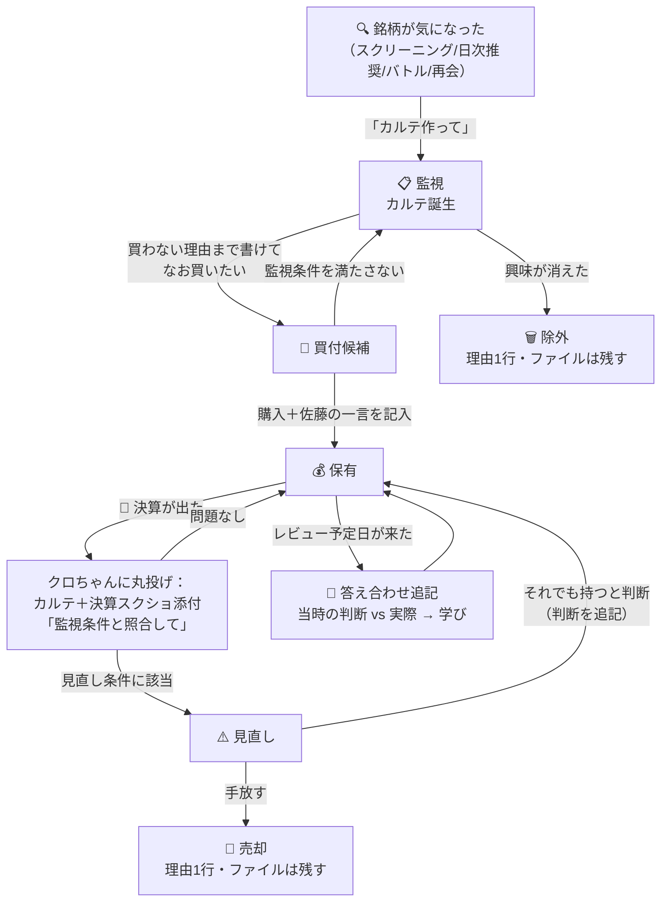

# stock-nikki 編集部ドキュメント

「Sから始まるStock日記」（ https://stock-nikki.com ）の運営戦略・記事制作パック・プロンプト集。

**このREADMEだけ開けばOK。** 各記事タイプの依頼プロンプトをここに集約してあります。詳細ルールを確認したい時だけ、該当ファイルを開いてください。

---

## 📁 ファイル構成

| ファイル | 中身 | 開くタイミング |
|---|---|---|
| `phase1_site_strategy_202607.md` | サイト戦略（ポジショニング・SEO3レーン・やらないこと） | 方針に迷った時 |
| `phase2_article_packs_vol1.md` | パックA〜D：週次・S株入口・振り返り・日次 | 型の詳細確認 |
| `phase2_article_packs_vol2.md` | パックE〜G：個別分析・決算・配当優待 | 〃 |
| `phase2_article_packs_vol3.md` | パックH〜I：バトル運用・AI活用 | 〃 |
| `phase2_article_packs_vol4.md` | パックJ〜L：カレンダー・再起ログ・レビュー | 〃 |
| `phase3_operations_roadmap.md` | 運用フロー・ロードマップ・残タスク | 週次/月次の段取り確認 |
| `phase4_editorial_policy.md` | 編集方針（最上位ルール・十条憲法） | 迷ったら最優先で読む |
| `stock_karte_template_v1.md` | 銘柄カルテのテンプレと運用ルール | カルテ新規作成時 |

**優先順位：Phase 4 ＞ 各パック ＞ Phase 1〜3**（矛盾したらPhase 4が勝つ）

## 🏛️ 憲法の要点（これだけ覚える）

- 第一読者は**未来の佐藤**。PV・収益は副産物
- **書いてから、買う。書いてから、売る**
- 義務は2つだけ：**金曜の週次**と**買う前のカルテ**。あとは全部任意
- 迷ったら：「この記事は1年後の自分が読んで役に立つか？」

---

# 🚀 プロンプト・チートシート

クロちゃん（Claude）のプロジェクトに以下をコピペするだけ。共通ルールはプロジェクト側が知っているので、プロンプトは最小限でOK。

## 定型更新系（構成案なし・即作業）

### 週次ポートフォリオ更新（毎週金曜・義務）

```
週次ポートフォリオ更新お願いします。
添付：SBIスクショ、東証33業種TSV、前回HTML

【今週買った銘柄】
【今週の所感（1〜3行）】
【再会銘柄トピック（あれば）】
```

### 日次短報（任意・10〜15分）

```
日次短報お願いします。
添付：SBIスクショ（＋グラフ更新ありなら前回HTML）

【今日の一言（1〜2行）】
```

### イベントカレンダー（月1・25日前後）

```
イベントカレンダー記事お願いします。
【期間】YYYY/MM/DD 〜 YYYY/MM/DD
```

### 決算読み解き（決算期・スピード優先）

```
決算読み解きお願いします。カテゴリ：銘柄研究

【銘柄名・コード】
【決算資料（短信スクショ or 数値貼り付け）※必須】
【株価の反応（当日の値動き）】
【佐藤の第一印象（1〜2行）】

決算数値は添付資料の実値のみ使用してください（web検索の数値で上書きしない）。
スピード優先のため構成案不要・即作業でOKです。
```

### 銘柄カルテ作成（買う前・義務）

```
◯◯（コード）買います。カルテ作ってください。
推奨元：スクリーニング / 日次推奨 / バトル / 再会
```

→ ドラフト受領後、**「佐藤の一言」欄だけ自分で書く**（AIに書かせない唯一の欄）

## バトル系（水曜軸）

### 予測発表

```
バトル第N回【予測】お願いします。
【お題セクター】【判定日・判定基準】
【チャッピーの選択銘柄と言い分（貼り付け）】
```

### 結果発表（3点セット同日必須）

```
バトル第N回【結果】お願いします。
【両銘柄の判定日株価スクショ】※必須
→ 結果記事＋戦績固定ページ更新分＋サイドバーHTML更新分の3点を出力
```

## 構成案を先に確認する系

### S株入口記事（SEO主戦場・月2本目安）

```
S株入口記事お願いします。カテゴリ：投資基礎知識

【狙うキーワード】
【検索意図（読者が知りたいこと）】
【入れる実体験・実データ】
【関連させたい過去記事（あれば）】

構成案を先に出してください。
```

### 保有銘柄振り返り（連載・44銘柄）

```
保有銘柄振り返り#N お願いします。カテゴリ：銘柄研究

【銘柄名・コード】
【買った時期ときっかけ】
【佐藤の所感・不安に思ってること】
【最新の株価・配当（スクショ添付 or 要確認前提）】

2014/2015年保有銘柄リストとの照合をお願いします。
構成案を先に出してください。
```

### 個別銘柄分析（非保有・買う前調査）

```
個別銘柄分析お願いします。カテゴリ：ウォッチリスト

【銘柄名・コード】
【気になったきっかけ】
【ウォッチリスト格付け（あれば）】
【株価・指標データ（スクショ or チャッピーTSV添付）】

197銘柄格付けとの整合、バトル対象銘柄との重複を確認してください。
構成案を先に出してください。
```

### 配当記事

```
配当記事お願いします。カテゴリ：損益報告（実績報告型）/ 投資基礎知識（解説型）

【系統】実績報告型 or 解説型
【配当データ（入金スクショ or dividend_fetcher出力）】
【今月の配当エピソード（初配当・増配など、あれば）】

構成案を先に出してください。
```

### AI活用記事（月1目安）

```
AI活用記事お願いします。カテゴリ：ブログ運営 or 投資基礎知識（内容次第で確認）

【系統】ツール公開 / ワークフロー公開 / 失敗談
【題材】
【素材（コード・プロンプト・スクショ・事件の経緯）】

構成案を先に出してください。
```

### 自己破産からの再起ログ（不定期・ノルマ化しない）

```
再起ログお願いします。カテゴリ：自己破産からの再起

【系統】手続き・実用型 / 記録・エッセイ型
【題材と経緯（時系列で）】
【出してOKな数字・日付／伏せる情報】

プライバシーガードのチェックを厳しめにお願いします。
構成案を先に出してください。
```

### 体験レビュー（月1目安・収益化枠）

```
体験レビュー記事お願いします。

【商品名】
【使用期間・使用シーン】
【良かった点・イマイチな点（箇条書きでOK）】
【アフィリンク先（楽天/もしも等）】

構成案を先に出してください。
```

---

## 🩺 銘柄カルテの運用フロー

**カルテ＝読み物ではなく「照合装置」。** 未来の佐藤は考えなくていい。過去の佐藤が書いた条件と現実を突き合わせるだけ。照合作業もクロちゃんに丸投げできる。



### 未来の佐藤がやることは3つだけ

| いつ | やること | 投げるプロンプト |
|---|---|---|
| 決算が出た時 | カルテ＋決算スクショを添付して丸投げ | `カルテの監視条件と照合して、決算メモ追記して` |
| 買い増したくなった時／急落した時 | カルテを添付して丸投げ | `カルテの買い増し条件・見直し条件と今の状況を照合して` |
| レビュー予定日（年1目安） | カルテを添付して丸投げ | `答え合わせ追記して。当時の判断はどうだったか判定も` |

→ 判断基準は全部カルテが覚えている。**佐藤が覚えることはゼロ**ｗ

### カルテの副産物（勝手に貯まるもの）

- **振り返り記事（#N）の下書き**：カルテ添付→「振り返り記事にして」で構成案いらず
- **推奨経路の成績データ**：年1回「スクリーニング/日次/バトル/再会、どの出会いが優秀だったか」を検証→スクリーニング条件・推奨プロンプト自体を改善
- **判断力の変化ログ**：Git履歴＝過去の自分の判断の変遷。間違ってた判断こそ答え合わせの教材

### ありがちな疑問

- **Q. 44銘柄全部いきなり作るの？** → No。新規購入時＋気が向いた時に1枚ずつ。既保有分は振り返り記事（#N）を書くついでに作るのが一石二鳥
- **Q. 売らない主義なのに見直し条件いる？** → 売るためじゃなく「前提が崩れたことに気づくため」。該当しても持ち続けてOK、その判断がまた答え合わせの材料になる
- **Q. 更新忘れそうｗ** → 忘れてOK。決算・急落・レビュー日という「イベント駆動」なので、日常メンテはゼロ。思い出した時に投げれば私が差分を埋める

---

## 📅 週間運用早見表

| 曜日 | やること | プロンプト |
|---|---|---|
| 水 | バトル（予測 or 結果） | バトル系 |
| 木（任意） | 週1本枠：入口/振り返り/分析/配当/AI活用/再起/レビューから1つ | 該当プロンプト |
| 金 | **週次定点観測（唯一の義務）** | 週次 |
| 随時 | 日次短報・カルテ | 日次/カルテ |

- 決算期（5・8・11・2月）：木曜枠は決算読み解きに振り替え
- 25日前後：翌月イベントカレンダー
- 疲れた週：木曜枠は休む。**金曜だけは守る**

## 🗂️ 記事タイプ→カテゴリ早見表

| 記事タイプ | カテゴリ | 構成案 |
|---|---|---|
| 週次・日次・配当実績 | 損益報告（pnl-report） | 不要 |
| S株入口・配当解説 | 投資基礎知識（investment-basics） | 必要 |
| 振り返り・決算 | 銘柄研究（stock-research） | 振り返り:必要／決算:不要 |
| 個別分析 | ウォッチリスト（watchlist） | 必要 |
| バトル | クロvsチャッピー（ai-battle） | 不要 |
| AI活用 | ブログ運営 or 投資基礎知識 | 必要 |
| 再起ログ | 自己破産からの再起（bankruptcy-recovery） | 必要 |
| イベントカレンダー | イベントカレンダー ※ | 不要 |
| 体験レビュー | ※受け皿検討中 | 必要 |

※カテゴリ整理の未決事項2件（イベントカレンダーのルール追記・レビュー枠）はPhase 3残タスク参照。

---

## ⚠️ 全記事共通の禁止事項（要点のみ）

- 売買推奨表現（「買うべき」「今がチャンス」「テンバガー」）
- 「億り人」をタイトル・見出しに使う
- 本名・勤務先等の特定情報（運営者表記は「佐藤」）
- 数値の断定（要確認表記 or スクショ実値検証）
- 追記の約束（振り返りは週次報告に一本化）
