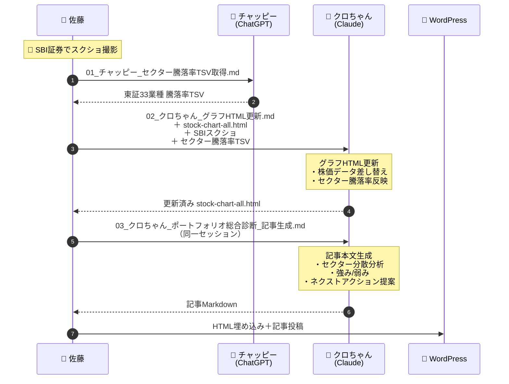

# stock-nikki-tools

**[Sから始まるStock日記](https://stock-nikki.com)** で使っている自作ツール集です。

S株（単元未満株）でコツコツDCA積立をやっている個人投資家が、AIと一緒に作ったツールを公開しています。

- 分析担当：クロちゃん（Claude）
- データ収集・画像生成：チャッピー（ChatGPT）
- 編集長：佐藤

## ツール一覧

### 📊 fundamental-analyzer

**ファンダメンタル分析ジェネレーター**

TSV形式の財務データを貼り付けると、6つの指標でS〜D判定＋総合評価を自動生成するHTMLツール。

- **判定指標**: PER / PBR / ROE / 配当利回り / 自己資本比率 / 営業利益率
- **使い方**: SBI証券のポートフォリオスクショをChatGPTに投げてTSVデータを取得 → このツールに貼り付け → 判定テーブルが生成される
- **技術**: HTML + CSS + JavaScript（スタンドアローン、サーバー不要）
- **🔗 ツールを使う**: [ファンダメンタル分析ジェネレーター](https://stock-nikki.com/tools/fundamental-analyzer/index.html)
- **📖 使い方ガイド**: [ファンダメンタル分析ジェネレーターの使い方](https://stock-nikki.com/fundamental-analyzer-guide/)
- **📖 制作記事**: [ChatGPT×Claudeの分業で、ファンダメンタル分析ジェネレーターを作ったｗ](https://stock-nikki.com/fundamental-analyzer-intro/)

### 📈 split-collector

**株式分割情報 収集スクリプト**

過去の保有銘柄リストに対して、指定期間内の株式分割履歴と現在の終値をまとめて取得するPythonスクリプト。

- **出力**: `split_history.tsv`（BOM付きUTF-8 / Excel対応）
- **取得内容**: 証券コード / 銘柄名 / 分割履歴 / 終値
- **データソース**: Yahoo Finance（yfinance）
- **必要なもの**: Python 3 + `pip install yfinance`
- **📖 ブログ記事**: [10年前のS株ポートフォリオ264万円をガチホしてたら611万円だった件](https://stock-nikki.com/portfolio-10years-simulation/)

### 📉 ポートフォリオ損益レポート

**損益レポート用グラフテンプレート**

週次ポートフォリオ報告で使用しているグラフのHTMLテンプレート。セクター別円グラフやトレンド分析チャートなど、損益レポート記事に埋め込むグラフをまとめています。

- **技術**: HTML + ECharts / Chart.js
- **📖 ブログ記事**: [ポートフォリオグラフに円グラフとトレンド分析を追加した話【AIと共同制作②】](https://stock-nikki.com/portfolio-graph-sector-upgrade/)

#### 週次更新ワークフロー

### 💰 dividend-fetcher

**配当＆優待データ取得スクリプト**

銘柄リストTSVを入力すると、yfinanceで配当・ファンダメンタルデータを取得し、とあるサイトｗから株主優待情報をスクレイピングして、TSVにまとめて出力するPythonスクリプト。

- **取得内容**: 株価 / 配当利回り（自前計算） / 1株配当 / PER / PBR / 時価総額 / 優待有無 / 優待内容 / 優待最低株数
- **異常値検証**: 配当利回り8%以上→要確認、15%以上→異常値疑い、30%以上→除外推奨を自動フラグ付け
- **ランキング対応**: 配当/優待/総合の3系統で利用可否を自動判定、記事掲載区分も付与
- **レジューム対応**: `--resume` で途中再開可能。とあるサイトのブロック時も取得済みデータは保持
- **とあるサイト対策**: 3〜5秒ランダム間隔 + UA ローテーション + 10連続エラーで自動停止
- **データソース**: Yahoo Finance（yfinance）+ とあるサイト
- **必要なもの**: Python 3 + `pip install yfinance pandas requests beautifulsoup4`
- **開発経緯**: Claude（コード生成）→ ChatGPT（実データQAレビュー3回）→ 佐藤（本番実行・検証）のAI3体CI/CDで v1→v3.1 まで6回改修

## 動作環境

| ツール | 必要なもの |
|---|---|
| fundamental-analyzer | ブラウザのみ（Chrome推奨） |
| split-collector | Python 3.8以上 + yfinance |
| ポートフォリオ損益レポート | ブラウザのみ（Chrome推奨） |
| dividend-fetcher | Python 3.8以上 + yfinance + pandas + requests + beautifulsoup4 |

## ライセンス

MIT License

## リンク

- ブログ: [Sから始まるStock日記](https://stock-nikki.com)
- X: [@s_stock_nikki](https://x.com/s_stock_nikki)