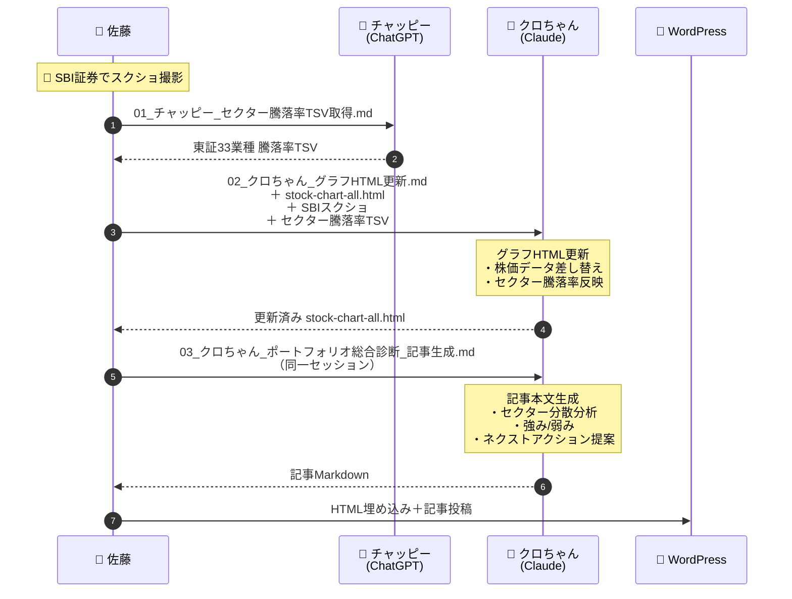

```mermaid
sequenceDiagram
    autonumber
    participant S as 🧑 佐藤
    participant C as 🤖 チャッピー<br>(ChatGPT)
    participant K as 🐾 クロちゃん<br>(Claude)
    participant W as 📝 WordPress

    Note over S: 📸 SBI証券でスクショ撮影

    S->>C: 01_チャッピー_セクター騰落率TSV取得.md
    C-->>S: 東証33業種 騰落率TSV

    S->>K: 02_クロちゃん_グラフHTML更新.md<br>＋ stock-chart-all.html<br>＋ SBIスクショ<br>＋ セクター騰落率TSV
    Note over K: グラフHTML更新<br>・株価データ差し替え<br>・セクター騰落率反映

    K-->>S: 更新済み stock-chart-all.html

    S->>K: 03_クロちゃん_ポートフォリオ総合診断_記事生成.md<br>（同一セッション）
    Note over K: 記事本文生成<br>・セクター分散分析<br>・強み/弱み<br>・ネクストアクション提案

    K-->>S: 記事Markdown

    S->>W: HTML埋め込み＋記事投稿
```